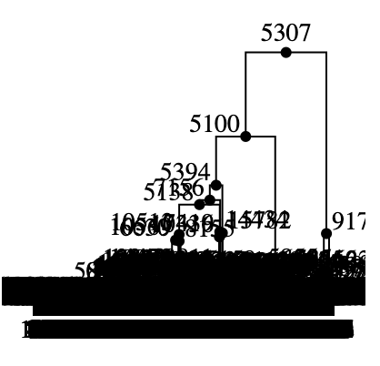

> BCM HGSC / DNAnexus Hackathon, Aug 28-31, 2024

# Haploblock_Clusters 

## Contributors

Ben Busby, Jędrzej Kubica, Minal Jamsandekar, Umran Yaman, Eleni Mourouzidou, Michael Olufemi

## Introduction

Our overarching goal was to generate a similarity matrix of interpopulation haploblocks, taking into account both rare and common variants. In theory, the human genome consists of multiple haplotype blocks that are shared among the individuals from all populations. At any given locus, certain haplotypes are more prone to the disease than others depending on the type of variation they carry. Thus, linking the mutation information with the haplotype would enhance our understanding of the implications of a given mutation (or variation) and relatedness between individuals in a population. In this hackathon, we aimed to develop a bioinformatics workflow that would enable us to do so.

We are taking the help of software for haplotype phasing SHAPEIT5 (Hofmeister et al., 2023) and relatedness calculation ARG-Needle (Zhang et al., 2023) to obtain the haplotype blocks containing SV information and their relatedness with each other. We then create a similarity matrix for the haplotype blocks for all samples within different populations. We further link this information to SVs (in a VCF file).

## Methods

#### Data

We downloaded phased VCFs for 3 populations from The 1000Genomes Project (The 1000 Genomes Project Consortium, 2015):
- British in England and Scotland (GBR): https://www.internationalgenome.org/data-portal/population/GBR
- Puerto Rican in Puerto Rico (PUR): https://www.internationalgenome.org/data-portal/population/PUR
- Chinese Dai in Xishuangbanna, China (CDX): https://www.internationalgenome.org/data-portal/population/CDX
 
As well as genetic maps from:
- ftp://ftp.1000genomes.ebi.ac.uk/vol1/ftp/pilot_data/technical/reference/genetic_map_b36.tar.gz
- https://alkesgroup.broadinstitute.org/Eagle/downloads/tables/

#### Workflow

During the hackathon, we aimed to develop a prototype workflow for haplotype block similarity calculation. Firstly, as the proof-of-concept, we took phased VCF files from 1000Genomes for chromosome 6 for the 3 populations of interest. The VCF files had been already phased with SHAPEIT2. Then, we used Plink2 to convert those phased VCF files to HAP files (command: `plink2 --vcf phased.vcf --export hap --out new_filename_prefix`). Then, we used the HAP files as input for ARG-Needle (Zhang et al., 2023). We split the input data into haploblocks based on recombination hotspots (2089 haploblocks for chromosome 6).

To running ARG-Needle on a DNAnexus cloud-workstation (https://documentation.dnanexus.com/developer/cloud-workstation), we set off with installing the software: `pip3 install --upgrade pip`, then `PATH=$PATH:/home/dnanexus/.local/bin`, `pip install arg-needle`. Finally, we run it with `arg_needle --hap_gz PUR_chr6.hap.gz --map genetic_map_b36 --chromosome 6 --out PUR_chr6 --mode sequence` (requires a lot of memory).

As a result, we obtained ARGN files that can be converted into _tskit.TreeSequence_ objects, and subsequently analyzed or visualized using the _tskit_ library (https://tskit.dev/tutorials/viz.html).

Furthermore, we aimed to build a DNAnexus workflow which takes VCF files as input and generates similarity matrix among the haplotype blocks. The process involves multiple steps where first, the VCF files are phased using SHAPEIT5 (Hofmeister et al., 2023) to generate MAP files for the genetic map. Both HAP and MAP files are provided as input for ARG-Needle which generates graphs for the haplotype blocks. A custom script then calculates relatedness between haplotype blocks. 
To test our workflow, we leveraged the genomic data for chromosome 6 from 1000 Genome Project for three populations (each population containing 100 individuals), namely Dai Chinese (CDX), Puerto Rican from Puerto Rico (PUR), British from England and Scotland (GBR). 

## Results

We leverage the principles of ancestral recombination graph (ARG) that are used to determine how ancestral genetic material is passed onto its descendants considering the coalescent time and recombination. ARG-Needle program can infer history of inheritance from hundreds of thousands of genome samples.

Due to a short timeframe of the hackathon, we produced a proof-of-principle result (a "baby tree") that represents the visualization of ARG-Needle output for a small chunk of chromosome 6 (100 SNPs of the first hyploblock) for the CDX population. For the visualization we first converted the ARGN output from ARG-Needle into a _tskit.TreeSequence_ object, and used _tskit_ to produce the SVG figure.

## Use cases

  - rare germline mutations
  - cancer driver mutations
  - MHC

## Future directions

  - Develop an easy-to-use pipeline to build a full similarity matrix for a population or populations
  - Understand the relative penetrance of rare variants in the background of other haploblocks
  - Understand the relative aggressiveness of cancer driver mutations in the background of their haploblocks
  - Understand the presentation of cancer subtypes in the context of other haploblocks
  - Understand the relative contribution of MHC, Ig and HLA related haploblocks to infectious disease susceptibility and presentation

## DNAnexus prototype workflow

## Hackathon plan

### Step 1:

- [x] Download phased vcfs from 1000 genome for one chromosome (Jedrzej)
- [x] Download recombination hotspots for chromosome (Ben)
- [x] Make haploblock coordinate system by interpolating between recombination hotspots (Jedrzej and Ben) 
- [x] Get ARG-Needle working on DNANexus (Ben and Minal)
- [x] Get SHAPEIT5 working on DNAnexus (Ben and Jedrzej)
- [x] Run ARG-Needle (Minal)
- [ ] Get the similarity matrix (Jedrzej)
- [x] Figure out way to merge rare variants information to the haploblocks (Michael and Jedrzej)
  
        Rare variants are identified and extracted using bcftools based on a MAF threshold of less than 1%.
        The extracted variants are annotated with functional and genomic information using ANNOVAR.
        Using bedtools, these variants are mapped to haploblocks
  
- [ ] Figure out way to look at cancer drivers (Michael and Elena)
- [x] Figure out way to look at MHC/HLA/TCR (Minal and Umran)

_Notes_

   Major histocompatibility complex (MHC) on chromosome 6 of the human genome is a highly complex and polymorphic region crucial for immune system function, particularly through the Human Leukocyte Antigen (HLA) region, which presents antigens to T-cells. First-generation linkage disequilibrium (LD) or "genetic maps" aims to show how certain alleles inherited together and how haplotypes are organised within a MHC region (haplotype blocks). Identifying haplotype blocka are more efficient way to discover genes predisposing traits such as disease; instead of identifying individual SNPs, one can identify haplotype block with strong genetic association, thus approaches such as haplotype-tagSNPs would be used, decreasing the markers needed in the mapping process (PMID: 11586306). Previous efforts to create a diploid assembly has been done by Chin et al. (2020), where they created a human genome benchmark from a diploid assembly of the HG002 sample grom Genome in a Bottle (GIAB), and identifying phased small and structural variants. This benchmark covers 94% of the MHC with 22,368 variants under 50 bp, 49% more than a mapping-based benchmark, and effectively detects errors in mapping-based callsets in regions with dense, complex variation (PMID: 32963235). 

  ARGs provide a fine-scale map of recombination events, which is crucial for understanding the breakpoints that define MHC haplotype blocks. Identifying ARGs within MHC haplotype blocks would allow us to understand how recombination and inheritance patterns contribute to disease associations observed in the MHC region. Thus we can refine mapping to a trait e.g. disease, to more accurately pinpoint causal variants within haplotype blocks that influence disease susceptibility.

  The approach to look at MHC/HLA region in our project could be extracting the MHC variants from ARG-Needle output and compare with existing MHC variants to MHC variants from GIAB benchmark study (PMID: 32963235). By doing that, we would be suggesting to infer a point/block of haplotype blocks from the variants truth set. For that, We can use bcftools with view functionality, specifying ~5MB MHC regions genomic location(chr6:28510020-33480577, GRCh38), or the bed file obtained conventionally from fasta file with GRCh38 genome build. Alternatively, we can compare our phased haplotype blocks with existing MHC variants, using hap.py (https://github.com/Illumina/hap.py). Recently Shafin K. et al (2021) used a similar approach to benchmark the MHC region against the Genome in a Bottle project (GIAB) truth set (PMID: 34725481).

### Step 2:

- [ ] Hypothetical hypothesis journeys and figures (ALL)
- [ ] Get the SV dataset and try to implement step 1 on the SV dataset/WGS (Elena)
- [ ] Glue software together (Elena/Jedrzej/Ben)
- [ ] Test use cases (ALL)

## References

1. Hofmeister, R.J., Ribeiro, D.M., Rubinacci, S. et al. Accurate rare variant phasing of whole-genome and whole-exome sequencing data in the UK Biobank. Nat Genet 55, 1243–1249 (2023). https://doi.org/10.1038/s41588-023-01415-w
2. Zhang, B.C., Biddanda, A., Gunnarsson, Á.F. et al. Biobank-scale inference of ancestral recombination graphs enables genealogical analysis of complex traits. Nat Genet 55, 768–776 (2023). https://doi.org/10.1038/s41588-023-01379-x
3. Delaneau, O., Zagury, JF., Robinson, M.R. et al. Accurate, scalable and integrative haplotype estimation. Nat Commun 10, 5436 (2019). https://doi.org/10.1038/s41467-019-13225-y
4. Lewanski AL, Grundler MC, Bradburd GS. The era of the ARG: an empiricist's guide to ancestral recombination graphs. ArXiv [Preprint]. 2023 Oct 18:arXiv:2310.12070v1. Update in: PLoS Genet. 2024 Jan 18;20(1):e1011110. doi: 10.1371/journal.pgen.1011110. PMID: 37904740; PMCID: PMC10614969.
5. Zhang, B.C., Biddanda, A., Gunnarsson, Á.F. et al. Biobank-scale inference of ancestral recombination graphs enables genealogical analysis of complex traits. Nat Genet 55, 768–776 (2023). https://doi.org/10.1038/s41588-023-01379-x
6. The 1000 Genomes Project Consortium. A global reference for human genetic variation. Nature 526, 68–74 (2015). https://doi.org/10.1038/nature15393
